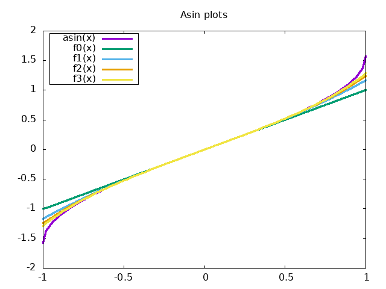

# asin(x) funkcijas aproksimācija izmantojot Teilora rindu

Izmantojot Teilora rindu ir iespējams veikt dažādu sarežģītu funkciju _f_ aproksimāciju. Laboratorijas darba laikā tika izstrādāta C programma, kura, izmantojot Teilora rindu aproksimē `asin(x)` funkcijas vērtību padotajam mainīgajam `x`.



Izmantojot `gnuplot` grafiku vizualizācijas rīku ir iespējams uzskatāmi parādīt Teilora rindas darbības principu. Dotajā attēlā ir redzams `asin(x)` funkcijas grafiks visā tā definīcijas apgabalā `[-1,1]`. Funkcijas `f0(x)` - `f3(x)` ir pirmo trīs rezultējošo Teilora rindas funkciju grafiki funkcijai `asin(x)`. Kā redzams, katra nākamā funkcija rindā rada grafiku, kas aiz vien vairāk pietuvinās funkcijai `asin(x)`. Saskaitot katras šīs funkcijas vērtību mainīgajam `x` ir iespējams iegūt vērtību, kas ir pietuvināta funkcijas `asin(x)` patiesajam rezultātam.

## Programmas darbības apraksts un analīze

Nokompilējot failu `main.c` izmantojot sekojošu komandu:
```shell
$ mkdir build && gcc main.c -o build/asin -lm
```
Un palaižot izpildāmo failu:
```shell
$ ./build/asin
```
Lietotājam tiks prasīts ievadīt skaitli `x` diapazonā no `[-1, 1]`. Pēc tam kad lietotājs ievadīja skaitli un nospieda `Enter`, tiek aprēķināta un izvadīta `asin(x)` vērtība izmantojot Linux operētājsistēmas `asin(x)` funkcijas realizāciju. Tālāk tiek veikts funkcijas vērtības aprēķins izmantojot paša izstrādātu `asin(x)` realizāciju (kodā sauktu par `myAsin`). Programmas darbības piemērs aprēķinot `asin(0.64)`:

```
$ ./build/asin
Please input x in range [-1, 1]:
0.64

System calculated value of asin( 0.640000 ): 0.694498265626556032792393580166

a499 = 5.977155044032951594808740168598e-199      S499 = 0.694498265626556005524708942156
a500 = 2.440907761105425820287769977967e-199      S500 = 0.694498265626556005524708942156
Library calculated value of asin( 0.640000 ): 0.694498265626556005524708942156

Comparison:
System :  0.694498265626556032792393580166
Library:  0.694498265626556005524708942156
Delta  :  0.000000000000000027267684638010

               500
               ===                  (2 . k + 1)
               \        (2 . k)! . x
sin(0.64) =    /     = ------------------------
               ===      k       2
              k = 0    4  . (k!)  . (2 . k + 1)

                                 2    2
                      (2 . k - 1)  . x
recurrence relation: -------------------
                     2 . k . (2 . k + 1)
```
Sadaļā `Comparison` ir iespējams apskatīt abu funkciju rezultātu, cipars pret ciparu veidā. `Delta` vērtība ir `System` un `Library` vērtību starpība, lai varētu noteikt `myAsin` funkcijas rezultāta nobīdi no patiesā rezultāta.

Programma papildus izvada kopējo Teilora rindas matemātisko funkciju priekš `asin(x)`, taču faktiski šī funkcija netiek pielietota programmā, jo katra šīs funkcijas iterācija izmantotu pārlieku lielu atmiņas daudzumu matemātisku sakarību dēļ. Lai novērstu šo nepilnību tika noteikts rekurences reizinātājs, kas ir redzams izvades beigās. Rekurences reizinātājs ļauj efektīvāk izmantot Teilora rindas, izmantojot stipri mazāku resursu apjomu. Tas tiek panākts katrā vērtības aprēķina iterācijas reizē izmantojot iepriekšējās iterācijas rezultātu esošās iterācijas aprēķina veikšanai.
