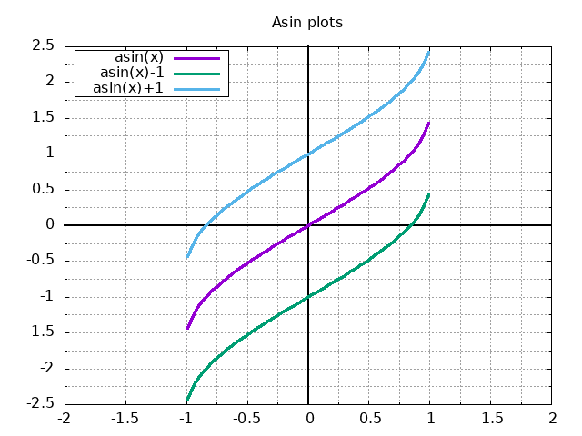

# asin(x) funkcijas saknes meklēšana diapazonā izmantojot dishotomijas metodi

Izmantojot dishotomijas metodi ir iespējams atrast vienu no funkcijas `f(x)` saknēm pie nosacījuma, ka funkcijai ir nepāra sakņu skaits. Funkcijas sakne ir argumenta `x` vērtība pie kura ir spēkā vienādība `f(x)=0`.
Izmantojot šo metodi ir arī iespējams noteikt pa `y` asi nobīdītas `f(x)` funkcijas sakni. Laboratorijas darba ietvaros tika apskatīta dishotomijas metode meklējot `asin(x)` sakni, un izstrādāta C programma, kas šo sakni atrod pie uzdotas precizitātes un citiem parametriem.



Dotajā attēlā ir redzams `asin(x)` funkcijas grafiks visā tā definīcijas apgabalā `[-1,1]`, kā arī šī funkcija nobīdītos veidos - `asin(x) - 1` un `asin(x) + 1`.

## Programmas darbības apraksts un analīze

Nokompilējot failu `main.c` izmantojot sekojošu komandu:
```shell
$ mkdir build && gcc main.c -o build/asin -lm
```
Un palaižot izpildāmo failu:
```shell
$ ./build/asin
```
Lietotājam tiks prasīts ievadīt:
- diapazona sākuma skaitli `a` diapazonā no `[-1, 1]`;
- diapazona beigu skaitli `b` diapazonā no `[a, 1]`;
- funkcijas nobīdes pa `y` asi vērtību `c`;
- saknes precizitātes skaitli `delta`.

Pēc tam kad lietotājs veica visas ievades, tiek meklēta funkcijas `asin(x) + c` sakne uzdotajā diapazonā, un pie uzdotās precizitātes.

Programmas darbības piemērs meklējot sakni funkcijai `asin(x) + 1` diapazonā `[0.5, 0.9]`:

```
$ ./build/asin
Please input lower range value a in range[-1:1]:
0.5
Please input upper range value b in range[a:1]:
0.9
Please input displacement value c in range[-1.57:1.57]:
1
Please input precision value delta:
0.0001

Iteration count to get desired precision: 12
The root can be found at x=0.841504, as asin(0.841504)-(1.000000)=0.000061
```
Programma izvada iterāciju daudzumu cik ir nepieciešams lai noteiktu sakni pie uzdotās precizitātes, kā arī `x` vērtību, jeb dotās funkcijas sakni.
