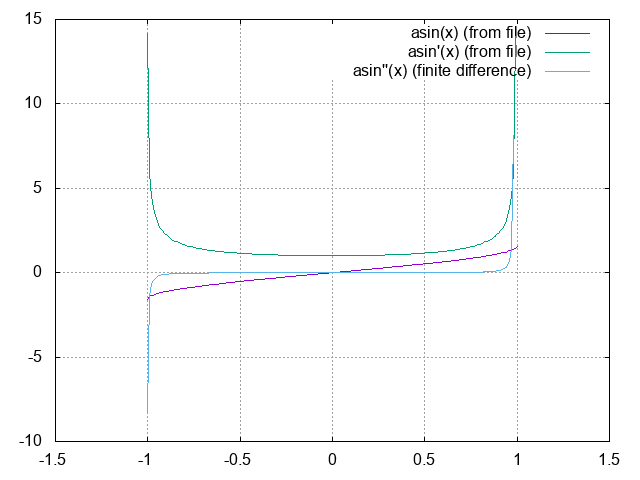

# asin(x) funkcijas pirmās un otrās pakāpes atvasinājums izmantojot skaitlisko diferencēšanu

Izmantojot skaitliskās diferencēšanas algoritmu ir iespējams veikt funkcijas atvasināšanu neizmantojot matemātiskos pārveidojumus. Šāds atvasināšanas veids ir noderīgs rakstot programmas, kur matemātiskas atvasināšanas veikšana nav iespējama.

Laboratorijas darba laikā tika izstrādāta C programma, kura veic funkcijas `asin(x)` pirmās un otrās pakāpes atvasināšanu atkarībā no uzdotajiem argumentiem.




Izmantojot `gnuplot` grafiku vizualizācijas rīku ir iespējams uzskatāmi parādīt rezultējošo atvasinājumu grafikus. Dotajā attēlā ir redzams `asin(x)` funkcijas grafiks, kā arī `asin(x)'` un `asin(x)''` funkciju grafiki. Attēlā redzamie grafiki ir uzdoti diapazonā no `[-1:1]` ar soli `0.01`. Grafiki ir izveidoti balstoties uz `derivative.dat` failā ierakstītajiem datiem, ko ir izveidojusi laboratorijas darba laikā izstrādātā C programma.

## Programmas darbības apraksts un analīze

Nokompilējot failu `main.c` izmantojot sekojošu komandu:
```shell
$ mkdir build && gcc main.c -o build/derivative -lm
```
Palaižot izpildāmo failu:
```shell
$ ./build/derivative
```
Lietotājam tiks prasīts ievadīt:
- diapazona sākuma skaitli `a` diapazonā no `[-1, 1]`;
- diapazona beigu skaitli `b` diapazonā no `[a, 1]`;
- `x` ass soļa lielumu `delta`.

Pēc tam kad lietotājs ievadīja visus skaitļus un nospieda `Enter`, tiek aprēķinātas visas `asin(x)` vērtības pie uzdotā diapazona un soļa un saglabātas masīvā. Kā nākamais solis programmas darbā ir šī masīva datu apstrāde, veicot pirmās un otrās pakāpes atvasinājumus un vērtību izvadīšanu.
Skaitliskā atvasināšana tiek realizēta pēc formulas:

`delta_f = f( x + delta_x ) - f( x )`

`f'( x ) = lim( delta_x -> 0 )( delta_f / delta_x )`

katru nākamo atvasinājuma kārtu atvasinot pēc šīm pašām formulām.

Ir svarīgi piebilst, ka otrās pakāpes atvasinājuma vērtība ir atkarīga no divu nākamo `asin(x)` funkciju rezultāta, kā arī pirmās pakāpes atvasinājuma vērtība ir atkarīga no nākamās `asin(x)` funkcijas rezultāta, sekojoši, dotajam diapazonam netiek aprēķinātas atvasinājumu vērtības pēdējām divām `asin(x)` funkcijas vērtībām masīvā. Tas ir arī uzskatāmi parādīts iepriekšminētajā attēlā, kur var novērot ka atvasinājuma grafika labā puse izskatās "īsāka", nekā kreisā puse.

Rezultāti tiek izvadīti uz `stdout`. Visi pārējie dati (dialogs ar lietotāju, datu kolonnu nosaukumi) tiek izvadīti uz `stderr`. Šāda pieeja ļauj faktisko programmas rezultātu izvadīt uz failu. Piemēram:
```shell
$ ./build/derivative > derivative.dat
```
ko vēlāk var ielasīt un apstrādāt `derivative.gp` skripts.
