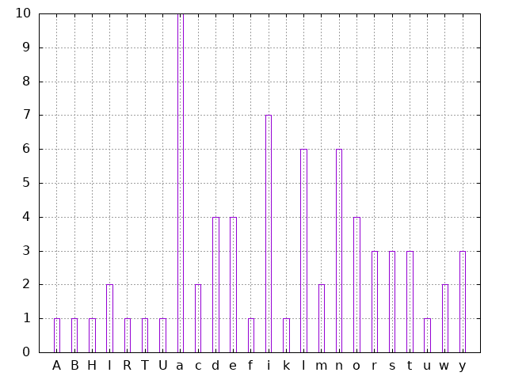

# Ievadtītā teikuma burtu statistika

Laboratorijas darba laikā tika izstrādāta C programma, kura izvada burtu statistiku par lietotāja ievadīo teikumu. Papildus tiek arī izvadīti visi teikuma burti sakārtotā secībā atbilstoši ASCII tabulas vērtībām.



Izmantojot `gnuplot` grafiku vizualizācijas rīku ir iespējams uzskatāmi parādīt teikuma _"Hello, my name is Brian and I study in RTU. Additionally I work as a waiter in a local cafe."_ burtu statistiku, ko ir iespējams izveidot pateicoties  C programmai.

# Programmas darbības apraksts un analīze

Nokompilējot failu `main.c` izmantojot sekojošu komandu:
```shell
$ mkdir build && gcc main.c -o build/statistics -lm
```
Un palaižot izpildāmo failu:
```shell
$ ./build/statistics
```

Lietotājam tiks prasīts ievadīt teikumu. Pēc tam kad lietotājs ievadīja savu teikumu un nospieda `Enter`, tiek noteikti visāda veida fakti par to.

Tā kā programmas pateisais rezultāts ir sakārtota teikuma burtu rinda, un burtu ASCII vērtības, tad šie dati tiek sūtīti uz `stdout`, bet visi pārējie dati tiek sūtīti uz `stderr`. Šāda pieeja ļauj ērti tālāk apstrādāt izejošos datus.

```
$ ./build/statistics > data.dat
Please input a sentence:
Hello, my name is Brian and I study in RTU. Additionally I work as a waiter in a local cafe.
Median symbol in the sentence is: d
Min letter in the sentence: A
Max letter in the sentence: y
Avarage letter in the sentence is: g
Most common letter in the sentence: a
```
Programma nosaka:

- Teikuma mediānas simbolu
- Teikuma mazākā burta vērtību pēc ASCII vērtību tabulas
- Teikuma lielākā burta vērtību pēc ASCII vērtību tabulas
- Teikuma vidējo burta vērtību pēc ASCII vērtību tabulas
- Visbiežāk sastopamāko burtu teikumā

Pēc komandas rindiņas izpildes tiek iegūts fails `data.dat`, kuru var apstrādāt ar `statistics.gp` skriptu. Šis skripts darbojas izmantojot `preprocess.sh` palīdzību. Lai no iegūtās burtu virknes varētu izveidot diagrammu, šie dati ir papildus jāapstrādā ar kādu ārēju rīku, jo `gnuplot` nav spējīgs veikt šādus pārveidojumus. Skripts `preprocess.sh` iegūtos datus pārveido par kolonnu, un saskaita cik katrs burts tika bieži sastapts. Ar `preprocess.sh` rezultātu `gnuplot` var ērti izveidot nepieciešamo diagrammu.
